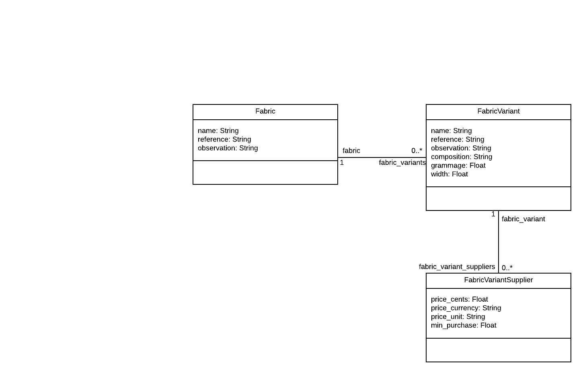

# README

O projeto é um CRUD da relação abaixo:

Essa é uma aplicação Rails 6.0.

## Pré-requisitos:

* Essa aplicação requer **Ruby 2.5**

## Configuração

* Verificar se a versão do Ruby está correta:

`ruby -v`

* Instalando as dependências com bundler:

`bundle install`

* Preparando o db:

`rake db:create db:migrate`

* Para servir:

`rails s`

* Acesse com: http://localhost:3000/fabrics
